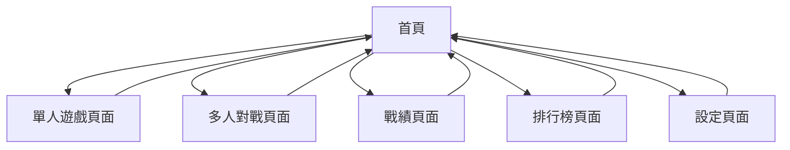

# 俄羅斯方塊線上遊戲產品需求文檔

## 1. 產品概述
俄羅斯方塊線上遊戲是一款支援單人和多人對戰的經典益智遊戲，提供訪客模式和Google帳號登入功能。
- 解決傳統俄羅斯方塊缺乏社交互動的問題，讓玩家能與全球其他玩家即時對戰，增加遊戲的競技性和趣味性。
- 目標成為最受歡迎的線上俄羅斯方塊遊戲平台，吸引休閒玩家和競技玩家。

## 2. 核心功能

### 2.1 用戶角色
| 角色 | 註冊方式 | 核心權限 |
|------|----------|----------|
| 訪客用戶 | 無需註冊，直接進入 | 可進行單人遊戲和多人對戰，但無法保存戰績 |
| 註冊用戶 | Google帳號登入 | 可進行所有遊戲模式，保存戰績記錄，查看排行榜，自訂設定 |

### 2.2 功能模組
我們的俄羅斯方塊線上遊戲包含以下主要頁面：
1. **首頁**：遊戲介紹、模式選擇、登入選項
2. **單人遊戲頁面**：經典俄羅斯方塊遊戲、分數顯示、遊戲控制
3. **多人對戰頁面**：即時對戰、對手狀態、競技模式
4. **戰績頁面**：個人戰績、歷史記錄、統計數據
5. **排行榜頁面**：全球排名、好友排名、成就系統
6. **設定頁面**：遊戲設定、音效控制、帳號管理

### 2.3 頁面詳情
| 頁面名稱 | 模組名稱 | 功能描述 |
|----------|----------|----------|
| 首頁 | 遊戲介紹區 | 顯示遊戲特色、玩法說明、最新消息 |
| 首頁 | 模式選擇區 | 提供單人遊戲、多人對戰、練習模式選項 |
| 首頁 | 登入區域 | Google登入按鈕、訪客模式入口、用戶狀態顯示 |
| 單人遊戲頁面 | 遊戲區域 | 俄羅斯方塊遊戲邏輯、方塊掉落、消除判定、遊戲結束檢測 |
| 單人遊戲頁面 | 控制面板 | 分數顯示、等級顯示、下一個方塊預覽、暫停/重新開始 |
| 單人遊戲頁面 | 操作控制 | 鍵盤控制（方向鍵、空白鍵）、觸控支援 |
| 多人對戰頁面 | 對戰區域 | 雙人遊戲畫面、即時同步、攻擊效果 |
| 多人對戰頁面 | 匹配系統 | 自動匹配對手、房間創建、邀請好友 |
| 多人對戰頁面 | 對戰狀態 | 對手資訊、倒數計時、勝負判定 |
| 戰績頁面 | 個人統計 | 總遊戲次數、勝率、最高分數、平均分數 |
| 戰績頁面 | 歷史記錄 | 最近對戰記錄、詳細戰績、時間軸顯示 |
| 戰績頁面 | 成就系統 | 解鎖成就、進度追蹤、獎勵領取 |
| 排行榜頁面 | 全球排名 | 全球玩家排行、分數排序、排名變化 |
| 排行榜頁面 | 好友排名 | 好友間比較、社交功能、挑戰邀請 |
| 設定頁面 | 遊戲設定 | 難度調整、控制設定、視覺效果 |
| 設定頁面 | 音效控制 | 背景音樂、音效開關、音量調節 |
| 設定頁面 | 帳號管理 | 個人資料、登出功能、數據同步 |

## 3. 核心流程

**訪客用戶流程：**
用戶進入首頁 → 選擇訪客模式 → 選擇遊戲模式（單人/多人） → 開始遊戲 → 遊戲結束顯示分數

**註冊用戶流程：**
用戶進入首頁 → Google登入 → 選擇遊戲模式 → 開始遊戲 → 遊戲結束保存戰績 → 查看排行榜/戰績

**多人對戰流程：**
選擇多人模式 → 匹配對手或創建房間 → 等待對手加入 → 倒數開始 → 即時對戰 → 勝負判定 → 戰績更新

## 4. 用戶介面設計
### 4.1 設計風格
- **主要顏色**：深藍色 (#1a237e) 作為主色，亮藍色 (#3f51b5) 作為輔助色
- **按鈕風格**：圓角矩形按鈕，具有漸變效果和懸停動畫
- **字體**：主要使用 'Roboto' 字體，標題 24px，正文 16px，小字 14px
- **佈局風格**：卡片式設計，頂部導航欄，響應式網格佈局
- **圖示風格**：使用 Material Design 圖示，簡潔現代風格

### 4.2 頁面設計概覽
| 頁面名稱 | 模組名稱 | UI元素 |
|----------|----------|--------|
| 首頁 | 遊戲介紹區 | 大型橫幅圖片、漸變背景、動態粒子效果、響應式卡片佈局 |
| 首頁 | 模式選擇區 | 大型圓角按鈕、懸停效果、圖示配色、網格佈局 |
| 首頁 | 登入區域 | Google登入按鈕（官方樣式）、訪客按鈕、用戶頭像顯示 |
| 單人遊戲頁面 | 遊戲區域 | 20x10網格、彩色方塊、流暢動畫、陰影效果 |
| 單人遊戲頁面 | 控制面板 | 數字顯示面板、進度條、小型預覽窗口、圓形按鈕 |
| 多人對戰頁面 | 對戰區域 | 雙屏幕佈局、即時更新、攻擊特效、勝負標示 |
| 多人對戰頁面 | 匹配系統 | 載入動畫、對手資訊卡片、房間列表、邀請按鈕 |
| 戰績頁面 | 個人統計 | 圓形進度圖、統計卡片、顏色編碼、趨勢圖表 |
| 戰績頁面 | 歷史記錄 | 時間軸設計、摺疊式列表、搜尋過濾、分頁導航 |
| 排行榜頁面 | 全球排名 | 表格設計、排名徽章、頭像顯示、分頁控制 |
| 設定頁面 | 遊戲設定 | 切換開關、滑桿控制、下拉選單、即時預覽 |

### 4.3 響應式設計
產品採用移動優先的響應式設計，支援桌面和移動設備，並針對觸控操作進行優化，確保在各種螢幕尺寸下都能提供良好的遊戲體驗。